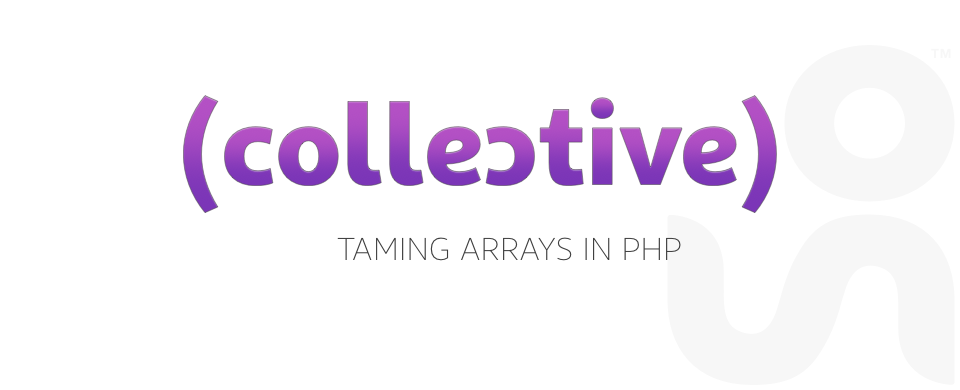

[](https://travis-ci.org/selvinortiz/collective)
[](https://packagist.org/packages/selvinortiz/collective)
[](https://packagist.org/packages/selvinortiz/collective)

## Description
> _Collective_ is a lightweight library that allows you to interact with native arrays in a more flexible and elegant way. It is inpired by _Laravel Collections_ and focused on performance.

### Requirements
- PHP 5.5
- [Composer](http://getcomposer.org) and [selvinortiz/collective](https://packagist.org/packages/selvinortiz/collective)

### Install
```bash
composer require selvinortiz/collective
```

### Test
```bash
sh spec.sh
```

### Usage
```php
// 1. Create a new instance of Collective
// 2. Give it an (optional) input array
// 3. Call methods on it
$input = ['name' => 'Collective', 'release' => 'alpha'];

(new Collective($input))->get('name');
// 'Collective'
```

### Reference
---

#### `get($key, $default = null)`
```php
$input = [
    'user' => [
        'name'   => 'Brad',
        'salary' => '100000'
    ]
];

(new Collective($input))->get('users.name');
// 'Brad'
```

#### `set($key, $value)`
```php
(new Collection())->set('user.name', 'Matt')->toArray();
// ['user' => ['name' => 'Matt']]
```

#### `count()`
```php
$input = [0, 1, 2, 3, 4, 5];

(new Collective($input))->count();
// 6
```

#### `first(callable $callback = null, $default = null)`
```php
$input      = [128, 256, 512, 'Brad', 'Brandon', 'Matt'];
$collective = new Collective($input);

$collective->first();
// 128

$collective->first(function($value)
{
    return strpos($value, 'Bra') !== false;
});
// Brad
```

#### `last(callable $callback = null, $default = null)`
```php
$input      = [128, 256, 512 'Brad', 'Brandon', 'Matt'];
$collective = new Collective($input);

$collective->last();
// 'Matt'

$collective->last(function($value)
{
    return strpos($value, 'Bra') !== false;
});
// Brandon
```

#### `map(callable $callback, array $default = [])`
Applies your _callable_ to each item in the collection

```php
$input = [128, 256, 512 'Brad', 'Brandon', 'Matt'];

(new Collective($input))->map(function($value)
{
    return is_string($value) ? '- '.$value : $value;
})->toArray();
// 128, 256, 512, '- Brad', '- Brandon', '- Matt'
```

#### `filter(callable $callback = null, array $default = null)`
Filters each item in the collection using your own _callable_

```php
$input = [128, 256, 512 'Brad', 'Brandon', 'Matt'];
(new Collective($input))->filter(function($value)
{
    return is_numeric($value);
})->toArray();
// 128, 256, 512
```

#### `reduce(callable $callback, $initial = null)`
Reduces a collection to a single value
```php
$input    = [
    ['name' => 'Brad', 'salary' => 100000, 'type' => 'yearly'],
    ['name' => 'Brandon', 'salary' => 250000, 'type' => 'yearly']
];

$callback = function ($value, $carry) {
    return $carry + $value['salary'];
};

(new Collective($input))->reduce($callback);
// 350000
```

#### `reverse()`
```php
(new Collective([128, 256, 512]))->reverse()->toArray();
// [512, 256, 128]
```

#### `flatten($depth = INF)`
```php
$input = [
    'level1' => [
        'name'   => 'Level 1',
        'level2' => [
            'name'   => 'Level 2',
            'level3' => [
                'name' => 'Level 3'
            ]
        ]
    ]
];

(new Collective($input))->flatten()->toArray();
// ['Level 1', 'Level 2', 'Level 3']
```

#### `then(callable $callback)`
Chains functions not defined by the _collection_ without breaking the _pipe_

```php
function filterToStrings($collective) {
    return $collective->filter(function ($value) { return is_string($value); });
}

function fourCharsOnly($collective) {
    return $collective->filter(function ($value) { return strlen($value) == 4; });
}

$collective->then('filterToStrings')->then('filterToLength')->toArray();
// 'Brad', 'Matt'
```

---

### License
**Collective** is open source software licensed under the **MIT License**
